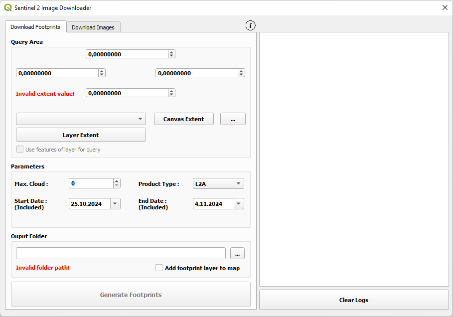
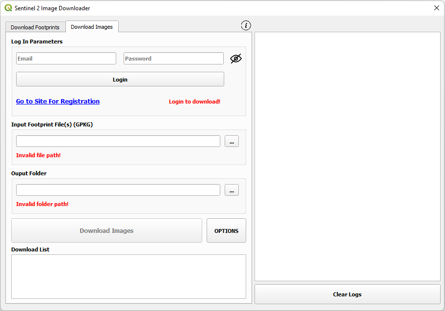

# QGIS Sentinel-2 Image Downloader Plugin

With this plugin, it is possible to download Sentinel-2 images(B01, B02, B03, B04, B05, B06, B07, B08, B8A, B09, B11, B12, TCI, SCL ) from the **_Copernicus Data Space Platform_** (https://dataspace.copernicus.eu/).
 
 
<table>
  <tr>
    <td></td>
    <td>
      <i>Download Footprints</i> section is first part of the analysis. In this section a <i><b>Geopackage (GPKG)</b></i> file is created. This file contains informations about the images to be downloaded such as "prod_id, prod_identifier, prod_download_url, cloudcover, processingdate, area_km". Images that are not desired to be downloaded should be deleted from the attribute table of the GPKG file.  
      <b>Query Area:</b> The extent of area of interest is selected here. It can be specified by "<i>Canvas Extent</i>", "<i>Layer Extent</i>" or "<i>Drawing Manually From the Map</i>".  
      <b>Parameters:</b> Parameters for the images to be downloaded are specified here. The parameters are <i>maximum cloud coverage(%)</i>, <i>pruduct type (L2A, L1C, Both)</i> and <i>date range</i>.  
       <b>Output Folder:</b> Folder where the footprint files will be created in is specified here.  
    </td>

  <tr>
    <td></td>
    <td>
      <i>Download Images</i> section is second part of the analysis. In this section, the images in the attribute table of the GKPG file are downloaded.(<i>Copernicus Data Space account is required.</i>)  
      <b>Go to Site for Registration:</b> This is a link to Copernicus Data Space platform for registration.  
      <b>Input Footprint File:</b> Geopackage file that was created in first section is specified here.  
      <b>Extract Files:</b> Sentinel images are downloaded in .zip format. So it has to be extracted before use. This option allows user to extract files after being downloaded automatically.  
      <b>Delete Zip File:</b> This option should be selected if .zip file is desired to be deleted after process. This option is available if "<i>Extract files</i>" option is selected.  
      <b>NDVI and NDWI:</b> This option should be selected if "<i>NDVI</i>" and "<i>NDWI</i>" indices are desired to be created after process. This option is available if "<i>Extract files</i>" option is selected.  
      <b>Clip by Extent as VRT:</b> If this option is selected, downloaded images are also clipped using specified extent beside original one. However, clipped image is saved in <i>Virtual Format(.VRT)</i> format not real one. This option is available if "<i>Extract files</i>" option is selected.  
      <b>Download only quicklook file:</b> A quicklook file is small sized RGB image in .jpg format. It is not georeferenced and can be used for previewing and determining the images to be downloaded. This option can be selected to download only quicklook images before the Sentinel image bands.
    </td>
  </tr>
</table>
