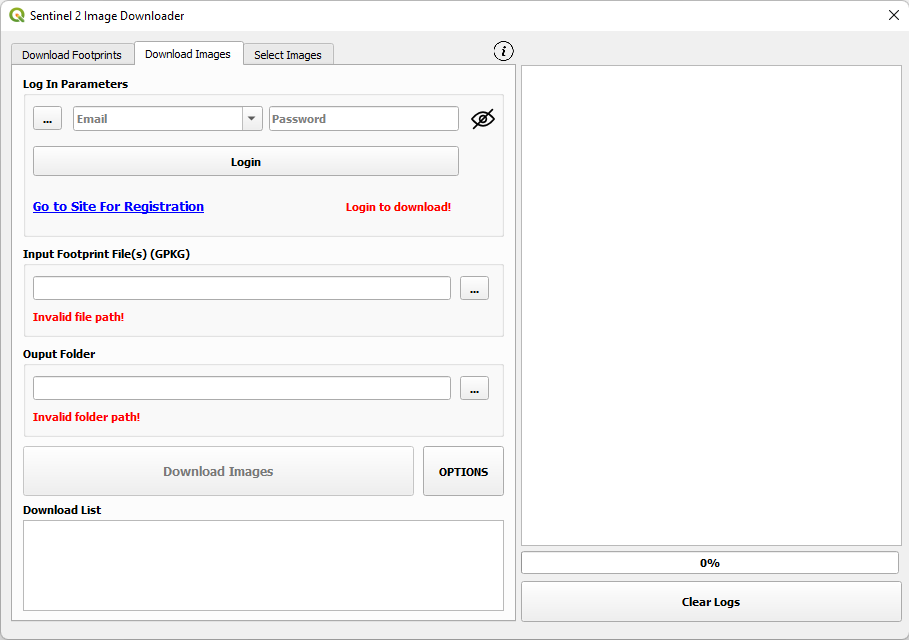
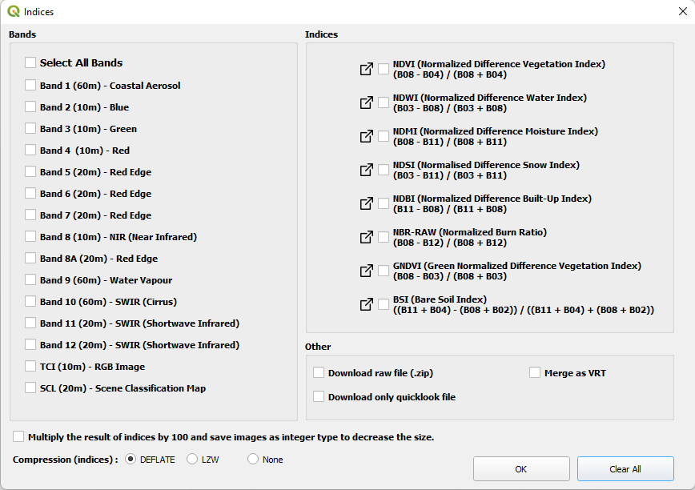

# QGIS Sentinel-2 Image Downloader Plugin

With this plugin, it is possible to download Sentinel-2 images (_B01, B02, B03, B04, B05, B06, B07, B08, B8A, B09, B10, B11, B12, TCI, SCL_) from the **_Copernicus Data Space Platform_** (https://dataspace.copernicus.eu/). The process consists of three steps : "_Download Footprints_", "_Download Images_" and "_Select Images_".

* In some version of QGIS (e.g. QGIS 3.40.5) some problem may occur because of numpy verison. Downgrading numpy version can fix it. (open osgeo shell and type **_"pip install --upgrade numpy==1.26.4"_**)

  

### 1-) Download Footprints

<i>Download Footprints</i> section is first part of the analysis. In this section a <i><b>Geopackage (GPKG)</b></i> file is created. This file contains informations about the images to be downloaded such as "<i>prod_id, prod_identifier, prod_download_url, cloudcover, processingdate, area_km</i>". Images that are not desired to be downloaded should be deleted from the attribute table of the GPKG file.

  

<b>Query Area:</b> The extent of area of interest is selected here. Multiple options are available to select _Query Area_: 
- <ins>_Canvas Extent_</ins> : Extent of current canvas is used for query,
- <ins> _Drawing Manually From the Map_</ins> : Extent of query area is drawned manually on the canvas,
- <ins> _Layer Extent_</ins> : Extent of selected layer is used for query. If **_Use features of layer for query_** option is selected, features of the selected layer is used for query. This option is only available for _vector_ files. _Polygon, Point, Polyline_ data are available.

 

<b>Parameters:</b> Parameters for the images to be downloaded are specified here. The parameters are <i>maximum cloud coverage(%)</i>, <i>pruduct type (L2A, L1C, Both)</i> and <i>date range</i>.

 

<b>Output Folder:</b> Folder for files to be downloaded is specified here.

 

<b>Out File Name (GPKG):</b> Name of the GPKG file for image footprints can be speficified here. If not speficied, a default name is determined.

 

  

### 2-) Download Images

<i>Download Images</i> section is second part of the analysis. In this section, the images in the attribute table of the GKPG files are downloaded.(<i>Copernicus Data Space account is required.</i>)

  

 

<b>Username and Password:</b> Username and Password are provided here. Username and password can be saved by clicking  button. 

 

 

<b>Go to Site for Registration:</b> This is a link to _Copernicus Data Space_ platform for registration.

 

<b>Input Footprint File(s):</b> Geopackage(GPKG) file(s) created in first section is specified here. Multiple files can be selected. 

 

<b>Output Folder:</b> Folder for files to be downloaded is specified here.

 

<b>OPTIONS:</b> Some extra options about download process can be configured in this section. Detailed explanation is below.

 

<b>Download List:</b> The summary about process can be found here.

  

### Download Options

<b>Bands:</b> Bands to be download can be selected here.

 

<b>Indices:</b> Remote sensing indices that is desired to be created after download can be selected here.

 

<b>Merge:</b> Downloaded images can be merged as VRT file based on _date, zone number and product type_ (e.g. _merged_vrt\20241102\z35\MSIL2A_).

 

<b>Other:</b> Beside downloading individual bands, _"raw zip file"_ and _"quicklook file of the image"_ also can be download by selecting this option.

 

<b>Multiply by 100:</b> If this option is selected, the result of indices are calculated by 100 and saved as integer instead of float. In this way, size of the image is reduced. For instance; if value of NDVI is 0.2346468 this value is saved as 23.

 

<b>Compression:</b> Compression method for saving indices can be selected here.

 

  

### 3-) Select Images

<i>Select Images</i> section is optional. In this section, the images to be downloaded can be selected using quicklook images.

 

The size of quicklook images are much smaller compared to the original Sentinel-2 images. Therefore, downloading them is much faster compared to original ones and can be used to determine which original images are desired to be downloaded.

 

<ins>To use this section</ins>;  
**1-)** The image footprints are downloaded using the "_Download Footprints_" section (in _GPKG_ format), 
**2-)** Using the GPKG file(s), the quicklook images are downloaded (using "_Download Images_" section) 
**3-)**  
- The downloaded quicklook images are opened in the QGIS environment, and unwanted images are removed from the project,
- In the "Select Images" section; "Get Layers" button is clicked (images will be listed),
- Original GPKG file is selected using  button,
- RUN  

or  

- The quicklook images can be opened in any way and the ones that are intended to be downloaded are saved into a new folder. **(OPTIONAL)**
- In the "Select Images" section; "Browse" button is clicked and images that are intended to be downloaded are selected (images will be listed),
- Original GPKG file is selected using  button,
- RUN  
	
After this process a GPKG file will be created with the suffix of "__clean_". This file can be used as footprint file to download desired images (in "_Download Images_" section).

 
